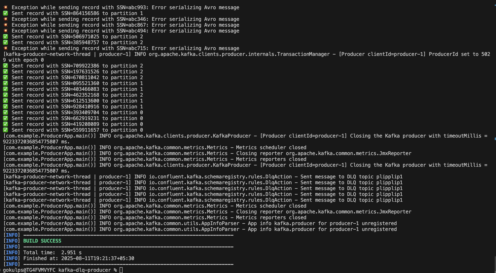

# CP-DataQualityRulesDemo

This repository showcases a demo of **data quality rules** on the **Confluent Platform**.

## 🚀 Step 1: Deploy Confluent Platform

First, deploy the Confluent Platform cluster on Kubernetes.  
You can use an existing instance or a managed Kubernetes service like **AKS**, **EKS**, etc.

### 🔐 License Setup

If you don’t have a Confluent license, you can remove the following section from your Confluent Platform (CP) config :

```yaml
spec:
  license:
    secretRef: confluent-license
```


Then create a Kubernetes secret using the following command:

```yaml
kubectl create secret generic confluent-license \
  --from-file=license.txt=./license.txt \
  --namespace confluent
```


### 🛠️ Install Confluent Operator

Add the Helm repo and install the Confluent Operator:

```bash
helm repo add confluentinc https://packages.confluent.io/helm
helm repo update

helm upgrade --install confluent-operator \
  confluentinc/confluent-for-kubernetes \
  --namespace confluent

```

Apply the Confluent Platform configuration:

```bash
cd CP
kubectl apply -f cp.yaml
```
Check the status of pods:
```bash
kubectl get pods -n confluent
```
Retrieve LoadBalancer endpoints:
```bash
kubectl get services -n confluent
```
Note down the load balancer endpoints for:

1) Kafka Bootstrap
2) REST Proxy
3) Schema Registry


## 📘 Step 2: Create Topics and Schemas

Navigate back to the root directory:

```bash
cd ..
````

Update the `variable.txt` file with the endpoints retrieved in the previous step.

Then run the setup script:

```bash
./setup.sh
```

This will create:

* A **success** topic
* A **DLQ (Dead Letter Queue)** topic
* A **schema** with a data quality rule

Use the **Confluent Control Center UI** to verify that the topics and schema have been created.

---

### ✅ Sample Schema and Rule

This schema includes a rule that checks the length of the `ssn` field.
If `ssn` is not exactly 9 characters long, the message is sent to the DLQ.

```json
{
  "schemaType": "AVRO",
  "schema": "{ \"type\": \"record\", \"name\": \"T4\", \"fields\": [ {\"name\": \"name\", \"type\": \"string\"}, {\"name\": \"email\", \"type\": \"string\"}, {\"name\": \"ssn\", \"type\": \"string\"} ] }",
  "ruleSet": {
    "domainRules": [
      {
        "name": "checkSsnLenTWEWT4",
        "kind": "CONDITION",
        "type": "CEL",
        "mode": "WRITE",
        "expr": "size(message.ssn) == 9",
        "onFailure": "DLQ",
        "params": {
          "dlq.topic": "dlq-topic"
        }
      }
    ]
  }
}
```

---

## 🧪 Step 3: Test Using Java Producer

You can test the setup using a Java-based Kafka producer (included in this repo) or a REST-based producer.Make sure to update the values.properties file with your broker’s and schema registry actual endpoints. 


Navigate to the Java producer project:

```bash
cd kafka-dlq-producer
```

Then compile and run the producer:

```bash
mvn clean compile exec:java -Dexec.mainClass=com.example.ProducerApp
```

Sure! Here's your rephrased text in Markdown format:

### Tips

If you encounter the error `b1.x cannot be resolved`, try the following:

1.Perform an `nslookup` on the load balancer endpoints. You can find these endpoints by running kubectl get services and locating kafka-1-lb, kafka-2-lb, and kafka-3-lb. Use their addresses for the lookup.
2. Add these entries to your `/etc/hosts` file in the format:

```

ip1 b1.mytest.io
ip2 b2.mytest.io
ip3 b3.mytest.io

```

This will help your system resolve the broker hostnames correctly.


This producer generates random records for testing the data quality rule.

---

### 🧱 Option: Create Maven Project from Scratch

If you'd like to create your own Maven project:

```bash
mvn archetype:generate \
  -DgroupId=com.example \
  -DartifactId=kafka-dlq-producer \
  -DarchetypeArtifactId=maven-archetype-quickstart \
  -DinteractiveMode=false
```

Then copy the `pom.xml` and the Java producer class (`ProducerApp.java`) from this repository into the newly generated project.

---

### 📸 Producer Output Screenshot

<p align="center">
  
</p>


---

## 📚 References

* https://docs.confluent.io/platform/current/kafka-rest/api.html#create-a-topic
* https://docs.confluent.io/platform/current/schema-registry/fundamentals/data-contracts.html#data-quality-rules

---

## 🎉 Happy Streaming!


